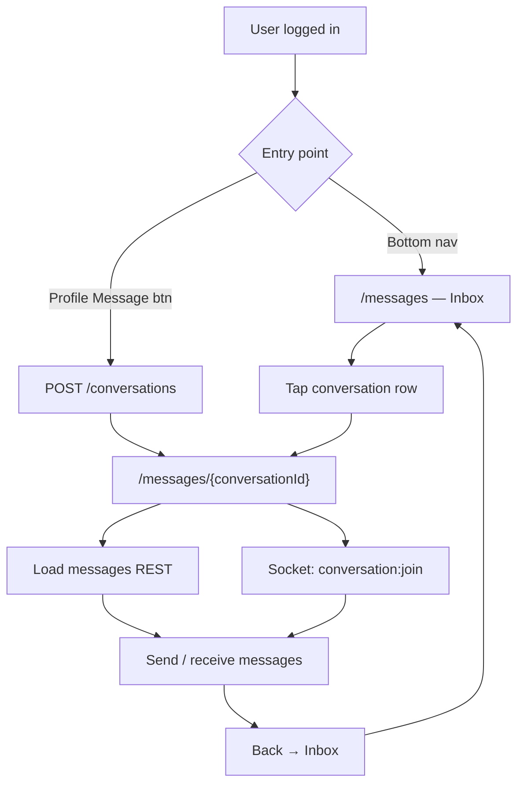

# BeanCircle — Direct Messages (Chat) Feature

> Audit date: 2026-06-03  
> Scope: **1:1 conversations** (`/messages`, `/messages/[id]`). Squad group chat is a separate, simpler feature (see [Squad chat vs DM](#squad-chat-vs-dm)).

---

## Table of contents

1. [Overview](#overview)
2. [User flows](#user-flows)
3. [Architecture](#architecture)
4. [What is implemented](#what-is-implemented)
5. [What works (end-to-end)](#what-works-end-to-end)
6. [What does not work or is incomplete](#what-does-not-work-or-is-incomplete)
7. [UI, colors, and visual design](#ui-colors-and-visual-design)
8. [API reference](#api-reference)
9. [Realtime (Socket.IO)](#realtime-socketio)
10. [File map](#file-map)

---

## Overview

BeanCircle has a **WhatsApp-style 1:1 direct messaging** stack:

| Layer | Location |
|--------|----------|
| REST API | `beancircle-api/src/chat/` |
| WebSocket | `beancircle-api/src/realtime/realtime.gateway.ts` |
| DB | Prisma `Conversation`, `ConversationMember`, `Message`, `MessageReaction` |
| UI | `beancircle-front/src/components/chat/` |
| Routes | `/[locale]/messages`, `/[locale]/messages/[id]` |
| Client state | `beancircle-front/src/stores/chat-store.ts` |

**Conversation model:** Exactly **two members** per conversation. `findOrCreate` reuses an existing 2-member thread or creates a new one. No group DMs.

**Message types (schema + API):** `TEXT`, `IMAGE`, `FILE`, `LOCATION`, `VOICE`, `VIDEO`, `STICKER`.

---

## User flows

### Flow diagram (happy path)



### 1. Open inbox

| Step | Route | Behavior |
|------|--------|----------|
| Tap **Messages** in bottom nav | `/messages` | `ConversationList` loads `GET /conversations` |
| Search | Same page | Filters by other member `name` / `username` (client-side) |
| Empty state | — | Copy from `messages.emptyListTitle` / `emptyListBody` (en + fa) |
| Unread badge on tab | Bottom nav | Sum of `chat-store.unreadByConversation` (see [Unread](#unread-badges)) |

**Not in inbox UI:** Pin/unpin conversation (`togglePinConversation` exists in store only), swipe actions, archive, block, mute.

### 2. Start a new chat

| Step | Where | API |
|------|--------|-----|
| Visit another user’s profile | `/profile/[username]` | — |
| Tap **Message** (not on own profile) | `startChat()` | `POST /conversations` `{ participantId }` |
| Redirect | `router.push(/messages/{id})` | — |

Cannot message yourself (`400` from API).

### 3. Chat room

| Step | Behavior |
|------|----------|
| Open thread | `ChatRoom` + `useChatRoom` hook |
| Load history | `GET /conversations/:id/messages` (default **30** messages, no “load more” in UI) |
| Realtime | Socket joins `conversation:{id}`; listens for `message:new`, edits, deletes, pin, seen, typing |
| Leave thread | Socket `conversation:leave`; bottom nav returns on `/messages` only |
| Layout | Full viewport (`h-dvh`); **bottom nav hidden** on `/messages/[id]` |

### 4. Send a message

| Input | Type | Transport |
|--------|------|-----------|
| Text + Enter / send button | `text` | `POST .../messages` + optimistic pending row |
| Photo / file / video picker | `image` / `file` / `video` | Base64 data URL in `attachment.url` (no S3 presign from chat UI) |
| Location (+ menu) | `location` | Browser `geolocation` |
| Mic (hold UI: tap to start voice) | `voice` | `MediaRecorder` → webm data URL |
| Mic long-press (context menu) | `video` | Same recorder with video track |
| Reply | — | `replyToId` + `replyToSnippet` on send |
| Sticker | `sticker` | **API only** — no composer UI |

**Validation (client):** Empty text blocked; simple spam heuristics (`validateMessageText`).

### 5. Message actions

Available via **tap bubble** (bottom sheet) or **right-click / long-press** (context menu on desktop):

| Action | Owner | API | Realtime event |
|--------|-------|-----|----------------|
| Reply | Anyone | Sends new message with reply fields | `message:new` |
| Copy | Anyone | Clipboard (client) | — |
| Forward | Anyone | **Broken** — see [Forward](#forward) | — |
| Pin / Unpin | Anyone (API allows any member) | `POST .../pin` | `message:pinned` |
| Edit | Sender, text only | `PATCH .../messages/:id` | `message:edited` |
| Delete | Sender | `DELETE` (soft: clears body, sets `deletedAt`) | `message:deleted` |
| React (👍❤️😂😮😢🔥) | Anyone | **Not called** — local Zustand only | `message:reaction` not subscribed |

### 6. Read receipts & typing

| Feature | Mechanism | Status |
|---------|-----------|--------|
| Per-message seen | `POST .../seen` when viewing peer’s latest unseen message | Works via REST; socket `message:seen` updates UI |
| Conversation read cursor | `message:read` socket → `markRead(lastReadAt)` | **Frontend never emits** `message:read` |
| Typing indicator | `conversation:typing` while drafting | Works **only when both users are in the same open room** |
| Delivery ticks | Derived from `seenBy` vs peer id | Shown on **last bubble in a sender group** (sent / delivered / seen) |
| Online dot | Global `presence` socket in `useSocket` | Works when peer connects (Redis-backed on API) |

### 7. Notifications

| Event | Backend | Frontend |
|-------|---------|----------|
| New DM | `NotificationType.NEW_MESSAGE`, `entityType: conversation` | Notifications page lists type as text only — **no deep link to `/messages/[id]`** |

---

## Architecture

```
┌─────────────────┐     REST (JWT)      ┌──────────────────┐
│  Next.js front  │◄───────────────────►│  NestJS API      │
│  React Query    │                     │  ChatController  │
│  Zustand chat   │     Socket.IO       │  ChatService     │
│  useChatRoom    │◄───────────────────►│  RealtimeGateway │
└─────────────────┘                     └────────┬─────────┘
                                                 │
                                                 ▼
                                        PostgreSQL (Prisma)
```

- **Auth:** `accessToken` in `localStorage`; socket `auth: { token }`.
- **WS URL:** `NEXT_PUBLIC_WS_URL` (default `http://localhost:3001`).
- **i18n:** `messages.*` keys in `messages/en.json`, `messages/fa.json`.
- **Dev mock:** `src/lib/api/mock-handler.ts` can simulate conversations when mock API is enabled.

---

## What is implemented

### Backend (`beancircle-api`)

- [x] List conversations with `otherMember` + `lastMessage`
- [x] Create / find 1:1 conversation
- [x] Paginated message history (`cursor`, `limit`, default 30)
- [x] Send message (all `MessageType` values)
- [x] Edit / soft-delete own messages
- [x] Pin messages (`isPinned`)
- [x] Per-message `seenBy` array + `markMessageSeen`
- [x] Toggle reactions (`ReactionEmoji`: `LIKE`, `HEART`, `FIRE`, `CLAP`)
- [x] `markRead` on `ConversationMember.lastReadAt` (socket-only entry today)
- [x] Push `NEW_MESSAGE` notifications to other member(s)
- [x] Realtime emit: `message:new`, `message:edited`, `message:deleted`, `message:pinned`, `message:seen`, `message:reaction`
- [x] Socket rooms: `conversation:join|leave`, `typing` / `conversation:typing`, `message:read`
- [x] Presence: `presence` broadcast on connect/disconnect

### Frontend (`beancircle-front`)

- [x] Inbox list with search, skeletons, empty states
- [x] Full chat room UI (header, wallpaper overlay, grouped bubbles, composer)
- [x] Optimistic send + failed state (no retry UI wired)
- [x] Swipe-left-to-reply (framer-motion drag)
- [x] Date separators, message grouping (3 min window)
- [x] Text, image, video, voice, file, location rendering
- [x] @mention highlighting in text
- [x] URL link preview cards in text messages
- [x] Reply strip in composer
- [x] Pinned message banner (collapses on scroll)
- [x] Edit bar (inline above composer)
- [x] Forward dialog UI (logic incomplete)
- [x] Voice recording bar (red destructive styling)
- [x] Typing indicator + header “X is typing…”
- [x] Message status icons (clock / check / double-check)
- [x] Persisted chat store (pinned conv ids, unread counts, local reactions)
- [x] `liveEnabled` flag in localStorage (`messages.live.enabled`) — **no settings toggle in UI**
- [x] en/fa strings for main inbox/room copy; many action labels still hardcoded English

---

## What works (end-to-end)

Verified against code paths (manual QA still recommended):

| Feature | Notes |
|---------|--------|
| Start chat from profile | `POST /conversations` → navigate to room |
| List conversations | Sorted by `updatedAt`; pinned convs first (local pin list) |
| Send & receive text | REST + `message:new` when socket connected |
| Realtime edit/delete/pin | Socket handlers patch `liveMessages` |
| Mark message seen | Auto-POST for latest peer message in open room |
| Typing indicator | In-room only, 3s timeout |
| Online indicator | Green dot `bg-emerald-500` on avatar when `presence` received |
| Attachments as data URLs | Works for small files; poor for large media / persistence |
| Location share | Requires browser permission |
| Voice/video record | Requires `getUserMedia`; outputs webm data URL |
| Spam filter on send | Blocks obvious keyboard mash |
| Soft delete display | “Message deleted” italic bubble |
| Bottom nav badge | Shows persisted + in-room increments (see bugs) |

---

## What does not work or is incomplete

### Critical / functional gaps

| Issue | Detail |
|-------|--------|
| **Forward** | `handleForward` calls `room.sendPayload` on the **current** `conversationId`, ignoring `forwardTarget`. Message is duplicated in the same chat, not sent to the selected conversation. |
| **Reactions** | UI uses Unicode emojis; API expects `ReactionEmoji` enum. No `POST .../reactions` call; no `message:reaction` listener. Reactions are **device-local** in Zustand and lost on refresh. |
| **Chat wallpaper** | `CHAT_WALLPAPER = '/d36bcceceaa1d390489ec70d93154311.jpg'` — file **not present** in `public/` (only default SVGs). Room shows broken background + `bg-black/35` overlay. |
| **Unread badges (realtime)** | `message:new` → `incrementUnread` only runs inside `useChatRoom`. No global listener when user is on inbox/home. Badge does not update live when a message arrives outside the open thread. |
| **Unread while in room** | Same handler increments unread for the **active** conversation when a peer message arrives — conflicts with `clearUnread` on mount. |
| **Message pagination** | API supports `cursor` / `nextCursor`; frontend never requests older messages. |
| **Media upload** | API has `POST /uploads` presign; chat sends **base64 data URLs** in DB — size/performance risk, not CDN URLs. |
| **Stickers** | Type supported server-side; no picker or send path in UI. |
| **Conversation pin** | `togglePinConversation` in store; **no UI** to pin inbox rows (pin icon only reflects stored ids). |
| **Header ⋮ menu** | `MoreVertical` button has no `onClick` / menu. |
| **Failed message retry** | `retryFailed` exported from hook, **not used** in `ChatRoom`. |
| **Live chat toggle** | `setLiveEnabled` exported, **no UI** (only localStorage key). |
| **`message:read`** | Never emitted from frontend; `lastReadAt` not updated via socket. |
| **Notification → chat** | No navigation from `NEW_MESSAGE` to thread. |
| **Group DMs** | Not supported (2-member constraint). |
| **i18n for actions** | Reply, Copy, Forward, Pin, etc. hardcoded in sheets/menus. |

### UX / edge cases

| Issue | Detail |
|-------|--------|
| **Peer in empty chat** | `peer` inferred from first message from non-self sender — header may show “Chat” until first message. |
| **Delivery status** | `delivered` checks `seenBy.includes(peerId)` but seen API adds **userId** strings; logic may skip “delivered” state. |
| **Image component** | `next/image` with data URLs may need `unoptimized` / remote patterns depending on Next config. |
| **Duplicate sockets** | `useSocket` (layout) + `useChatRoom` each open a connection; two sockets per user when in a room. |
| **Squad vs DM** | Separate UI and APIs; do not confuse with this feature. |

---

## UI, colors, and visual design

### Design system (theme tokens)

Chat uses **shadcn/Tailwind semantic colors** from `src/app/globals.css` (oklch), not hardcoded brand hex for bubbles:

| Token | Light mode role | Dark mode role |
|-------|-----------------|----------------|
| `background` | Page / composer backdrop | Near-black page |
| `foreground` | Primary text | White text |
| `primary` / `primary-foreground` | **Outgoing bubbles** | Inverted (light bubble on dark bg) |
| `muted` / `muted-foreground` | **Incoming bubbles**, previews, timestamps | Dark gray bubbles |
| `destructive` | Errors, voice recording UI, failed bubble border | Same family |
| `border` | Dividers, cards | Low-contrast borders |
| `ring` | Focus rings | — |

**Accent highlights**

| Element | Classes |
|---------|---------|
| Typing text (inbox + header) | `text-primary` |
| Unread row background | `bg-primary/5` |
| Reply composer strip | `border-primary`, label `text-primary` |
| @mentions (incoming) | `text-primary` |
| @mentions (outgoing) | `text-primary-foreground/80` |
| Online indicator | `bg-emerald-500` + `ring-background` |
| Offline indicator | `bg-muted-foreground/40` |
| Seen checkmarks | `text-primary` on `CheckCheck` |

### Chat room layout

| Area | Styling |
|------|---------|
| Page | `bg-background`, full `h-dvh` |
| Message list wallpaper | `bg-cover bg-center` + **`bg-black/35` scrim** (intended JPEG missing) |
| Outgoing bubble | `bg-primary text-primary-foreground`, tail `rounded-br-[6px]` |
| Incoming bubble | `bg-muted/80 text-foreground`, tail `rounded-bl-[6px]` |
| Failed pending | `border-destructive/40 bg-destructive/10 text-destructive` |
| Deleted | `bg-muted/50 italic text-muted-foreground` |
| Composer | `bg-background/95 backdrop-blur-md`, textarea `bg-muted/60` |
| Voice recording | `bg-destructive/10`, pulsing `bg-destructive` dot, `text-destructive` timer |

### Inbox layout

| Area | Styling |
|------|---------|
| Header | Sticky `bg-background/90 backdrop-blur-md` |
| Search | `bg-muted/40 rounded-2xl` |
| Rows | `hover:bg-muted/70`, unread `bg-primary/5` |
| Badge | Default shadcn `Badge` (primary styling) |

### Motion

- **framer-motion:** list row entrance, bubble appear, typing dots, swipe reply
- **AnimatePresence:** typing indicator in room

### Assets

| Asset | Status |
|-------|--------|
| `/d36bcceceaa1d390489ec70d93154311.jpg` | **Missing** from `public/` |
| Lucide icons | Throughout (Send, Mic, Pin, etc.) |

---

## API reference

Base path: global API prefix (same as other modules). All routes require auth.

| Method | Path | Description |
|--------|------|-------------|
| `GET` | `/conversations` | List threads for current user |
| `POST` | `/conversations` | `{ participantId: uuid }` → find or create |
| `GET` | `/conversations/:id/messages?cursor=&limit=` | History (newest-first query, returned chronological) |
| `POST` | `/conversations/:id/messages` | Send message (`SendMessageDto`) |
| `PATCH` | `/conversations/:id/messages/:messageId` | Edit text `{ body }` |
| `DELETE` | `/conversations/:id/messages/:messageId` | Soft delete |
| `POST` | `/conversations/:id/messages/:messageId/seen` | Add viewer to `seenBy` |
| `POST` | `/conversations/:id/messages/:messageId/reactions` | `{ emoji: ReactionEmoji }` toggle |
| `POST` | `/conversations/:id/messages/:messageId/pin` | `{ pinned?: boolean }` |

**Reaction enum (API):** `LIKE`, `HEART`, `FIRE`, `CLAP` — not the same as UI emojis.

---

## Realtime (Socket.IO)

### Client → server

| Event | Payload | When |
|-------|---------|------|
| `conversation:join` | `conversationId` | Enter room |
| `conversation:leave` | `conversationId` | Leave room |
| `conversation:typing` | `{ conversationId, typing? }` | User types |
| `message:read` | `{ conversationId }` | **Not used by front** |

### Server → client (DM)

| Event | Used in `useChatRoom` |
|-------|------------------------|
| `message:new` | Yes |
| `message:edited` | Yes |
| `message:deleted` | Yes |
| `message:pinned` | Yes |
| `message:seen` | Yes |
| `conversation:typing` | Yes |
| `typing` | Alias (server emits both) |
| `message:reaction` | **No** |
| `message:read` | **No** |
| `presence` | Yes (`useSocket` in layout) |
| `notification:new` | Yes (`useSocket`) |

---

## Squad chat vs DM

| | Direct messages | Squad chat |
|--|-----------------|------------|
| Route | `/messages/[id]` | `/squads/[id]` (tab/section) |
| API | `/conversations/...` | `/squads/:id/messages` |
| Socket room | `conversation:{id}` | `squad:{id}` |
| UI | Full component library under `components/chat/` | Simple bubbles in squad page |
| Features | Rich composer, replies, pin, etc. | Text-only style chat |

---

## File map

### Frontend

```
src/app/[locale]/(main)/messages/page.tsx          # Inbox
src/app/[locale]/(main)/messages/[id]/page.tsx     # Room wrapper
src/components/chat/
  chat-room.tsx          # Main room layout
  conversation-list.tsx  # Inbox
  composer.tsx           # Input + attachments
  hooks/use-chat-room.ts # Data + socket + mutations
  message-*.tsx          # Bubbles, content, status, actions
  utils.ts               # Grouping, validation, previews
  types.ts
src/stores/chat-store.ts
src/hooks/use-socket.ts  # Global presence + notifications
src/app/[locale]/(main)/layout.tsx  # Hides nav in room, runs useSocket
```

### Backend

```
src/chat/chat.controller.ts
src/chat/chat.service.ts
src/chat/chat.module.ts
src/realtime/realtime.gateway.ts
prisma/schema.prisma  # Conversation, Message, MessageReaction
```

---

## Suggested QA checklist

- [ ] Profile → Message → send text → receive on second account (two browsers)
- [ ] Typing indicator both sides in same room
- [ ] Edit / delete own message; pin banner appears
- [ ] Photo / voice / location (permissions)
- [ ] Forward to another conversation (expect failure until bug fixed)
- [ ] React to message → reload page (expect reactions gone)
- [ ] Wallpaper visible (expect missing image until asset added)
- [ ] Unread badge while on home vs inside room
- [ ] Dark mode bubble contrast

---

## Related docs

- [USER_FLOW.md](./USER_FLOW.md) — high-level app flows including Messages section
- [README.md](../README.md) — route table
