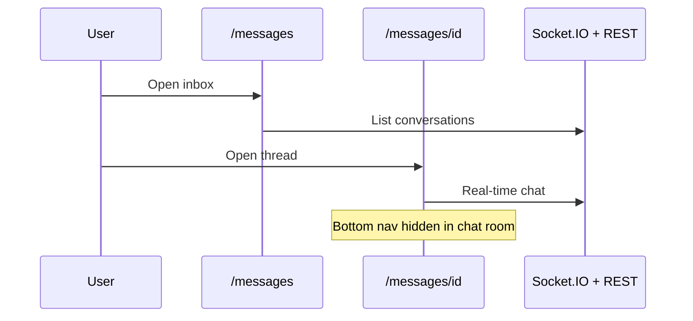

# Bean Circle — App User Flow

Mobile-first cafe community app (Next.js front + NestJS API). All routes are locale-prefixed (`/fa/...` or `/en/...`).

---

## High-level journey

```mermaid
flowchart TD
  Start([Open app]) --> Auth{Authenticated?}
  Auth -->|No| Login[/login]
  Auth -->|Yes| Onboard{Username set?}
  Login --> OTP[Phone OTP]
  Login --> Google[Google OAuth]
  OTP --> Onboard
  Google --> Callback[/auth/callback]
  Callback --> Onboard
  Onboard -->|No| Onboarding[/onboarding]
  Onboard -->|Yes| Main[Main app]
  Onboarding --> Main
  Main --> Home[/ Home feed]
  Main --> Discover[/discover]
  Main --> Passport[/passport]
  Main --> Messages[/messages]
  Main --> Profile[/profile]
```

---

## Authentication & entry

### Auth guard

The main layout (`(main)/layout.tsx`) protects authenticated routes:

1. No access token and no user → redirect to `/login`
2. User has `needsOnboarding` → redirect to `/onboarding`

Auth routes (`/login`, `/onboarding`) use a separate layout without bottom navigation.

### Login (`/login`)

Two sign-in methods:

| Method | Steps | Next step |
|--------|--------|-----------|
| **Phone OTP** | Enter phone → request OTP → enter code → verify | Onboarding if new user, else Home |
| **Google** | Tap Google → API OAuth → redirect to `/auth/callback?code=...` → exchange code for tokens | Onboarding if no username, else Home |

Tokens are stored locally; the app loads `/users/me` to confirm profile state.

### Google callback (`/auth/callback`)

Handles OAuth return: exchanges auth code (or legacy token params), sets session, routes to onboarding or home.

---

## Onboarding (`/onboarding`)

Required for new users before accessing the main app.

| Field | Required | Notes |
|-------|----------|-------|
| Username | Yes | Normalized and validated |
| Display name | No | |
| City | Yes | Loaded from `/users/cities` |
| Referral code | No | Applied via `/growth/referrals/apply` if ≥ 4 chars |

On success → **Home** (`/`).

---

## Main navigation

Bottom tab bar (hidden inside an active chat room):

| Tab | Route | Purpose |
|-----|-------|---------|
| Home | `/` | Social feed |
| Discover | `/discover` | Find cafes & people |
| Passport | `/passport` | Stamps, check-ins, rewards |
| Messages | `/messages` | Inbox |
| Profile | `/profile` | Redirects to `/profile/{username}` |

**Note:** `/explore` redirects to `/discover`.

---

## Home feed (`/`)

Primary social surface after login.

```mermaid
flowchart LR
  Home[Home feed] --> Create[/create]
  Home --> PostDetail[/post/id]
  Home --> AuthorProfile[/profile/username]
  Home --> CafeDetail[/cafe/id]
  Create --> Home
  PostDetail --> Comment[Add comment]
  PostDetail --> Like[Like / save / react]
```

### Actions on feed

- **Create post** — header button → `/create`
- **View post** — tap photo → `/post/[id]`
- **Engage** — like, emoji reactions, save, comment count
- **Visit author** — tap avatar/name → `/profile/[username]`
- **Cafe tag** — shows linked cafe when post is cafe-related

### Create post (`/create`)

- Optional image URL + caption
- Post type inferred: `TEXT`, `PHOTO`, or `PHOTO_TEXT`
- Submit → returns to Home

### Post detail (`/post/[id]`)

- Full post with same interactions as feed card
- Comment thread + add comment

---

## Discover (`/discover`)

City-aware cafe discovery and search.

### Default view (no search)

Horizontal sections from `/discover/sections`:

- Trending
- Recommended
- New
- Hidden gems

Sections use the user’s city when available.

### Search & filters

When query ≥ 2 chars, filters active, or city set:

- **Cafes** — filtered list via `/discover`
- **Users** — from `/search`

Filter chips refine cafe results.

### Quick links

- **Browse all cafes** → `/cafes`
- **Open passport** → `/passport`

### Cafe list (`/cafes`)

Searchable list of cafes in user’s city → tap → `/cafe/[id]`.

---

## Cafe detail (`/cafe/[id]`)

Central place for a single cafe.

| Action | Effect |
|--------|--------|
| Follow / unfollow | Subscribe to cafe updates |
| Check in | POST `/passport/checkin` — may earn stamp |
| Report | Flag cafe content |
| Write review | Rating + text → `/reviews/cafes/:id` |
| Check-in code | Deep link to `/passport?code=...` |
| Work report | Submit work-related report (component) |

Check-in success may show “new stamp” and refreshes passport data.

---

## Passport (`/passport`)

Gamification hub: stamps, Bean Score, badges, rewards.

```mermaid
flowchart TD
  Passport[Passport] --> QR[Enter check-in code]
  Passport --> CafeCheckin[Check in from cafe page]
  QR --> CheckinAPI[POST /passport/checkin]
  CafeCheckin --> CheckinAPI
  CheckinAPI --> Stamp{New stamp?}
  Stamp -->|Yes| UpdateGrid[Update stamp grid]
  CheckinAPI --> Badge{Badge earned?}
  CheckinAPI --> Reward{Reward unlocked?}
  Passport --> Redeem[Redeem reward]
  Redeem --> RedeemAPI[POST /passport/rewards/:id/redeem]
  Passport --> DiscoverLink[Discover more cafes]
  DiscoverLink --> Discover[/discover]
```

### Sections

1. **Bean Score** — points panel (activity-based scoring)
2. **Progress** — total stamps/check-ins, progress toward next reward
3. **QR / code check-in** — manual code entry or `?code=` deep link
4. **Your stamps** — grid of earned cafe stamps
5. **Badges** — earned achievement badges
6. **Rewards catalog** — unlock by stamps, redeem when eligible

---

## Profile (`/profile` → `/profile/[username]`)

### Own profile

- Stats: posts, followers, following
- Bean Score panel
- Link to **Settings**

### Other users’ profiles

- Follow / unfollow
- **Message** — creates conversation → `/messages/[id]`

---

## Messages (`/messages`, `/messages/[id]`)



- **Inbox** — conversation list with unread badge on Messages tab
- **Chat room** — full-screen messaging; socket connection via main layout
- **Start chat** — from another user’s profile

---

## Community (`/community`)

Secondary route (not in bottom nav). City-scoped:

1. **Challenges** — progress bars, reward points on completion
2. **Events** — RSVP (Going / Interested), link to host cafe
3. **Community feed** — posts from `/community/feed`

---

## Settings & account (`/settings`)

Reached from own profile or `/profile` placeholder.

| Section | Action |
|---------|--------|
| Theme | Light / dark toggle |
| Language | Switch `fa` ↔ `en` (full page reload) |
| Admin panel | `/admin` — ADMIN role only |
| Referrals | View/share code, apply someone else’s code |
| Owner dashboard | `/owner` |
| Gift coffee | `/gift` |
| Notifications | `/notifications` |
| Logout | Clears session → `/login` |

---

## Gift coffee (`/gift`)

1. Enter amount
2. Create gift via POST `/gifts`
3. Display voucher QR code and code string

Accessible from Settings.

---

## Notifications (`/notifications`)

List of in-app notifications (type, actor, timestamp). Accessible from Settings.

---

## Owner flows

For cafe owners managing their venues.

### Owner dashboard (`/owner`)

1. **Claim cafe** — enter claim code (`CLM-XXXX`) → POST `/owner/cafes/claim`
2. **Your cafes** — list owned cafes → `/owner/[id]`

### Owner cafe detail (`/owner/[id]`)

- Analytics: check-ins (30d/total), reviews, stamps, followers, rating
- Check-in code display
- Edit cafe name, toggle partner status
- Recent check-ins list

---

## Admin (`/admin`)

**ADMIN role only** — non-admins redirected to Home.

Read-only JSON dumps for:

- Users
- Cafes
- Reviews
- Reports
- Check-ins
- Gifts

Linked from Settings when user role is ADMIN.

---

## User roles summary

| Role | Typical flow |
|------|----------------|
| **Guest / unauthenticated** | Login only |
| **New user** | Login → Onboarding → Main app |
| **Member** | Feed, discover, passport, social, messaging |
| **Cafe owner** | Above + owner dashboard & cafe management |
| **Admin** | Above + admin panel |

---

## Route reference

| Path | Screen |
|------|--------|
| `/login` | Phone OTP + Google sign-in |
| `/onboarding` | Username, name, city, referral |
| `/auth/callback` | OAuth token exchange |
| `/` | Home feed |
| `/discover` | Cafe discovery & search |
| `/explore` | Redirects to discover |
| `/cafes` | Cafe directory |
| `/cafe/[id]` | Cafe detail |
| `/passport` | Stamps & rewards |
| `/create` | New post |
| `/post/[id]` | Post detail & comments |
| `/community` | Challenges, events, community feed |
| `/messages` | Inbox |
| `/messages/[id]` | Chat room |
| `/profile` | Redirect to own profile |
| `/profile/[username]` | User profile |
| `/settings` | Preferences & links |
| `/gift` | Gift coffee voucher |
| `/notifications` | Notification list |
| `/owner` | Owner dashboard |
| `/owner/[id]` | Owner cafe analytics |
| `/admin` | Admin data views |

---

## Key cross-links

| From | To | Trigger |
|------|-----|---------|
| Home | Create | + button |
| Feed card | Post / Profile / Cafe | Tap content |
| Discover | Cafe / Passport / Cafes | Cards & links |
| Cafe | Passport | Check-in code link |
| Profile (other) | Messages | Message button |
| Profile (self) | Settings | Settings link |
| Settings | Owner / Gift / Admin / Notifications | Menu links |
| Passport | Discover | “Discover cafes” CTA |
